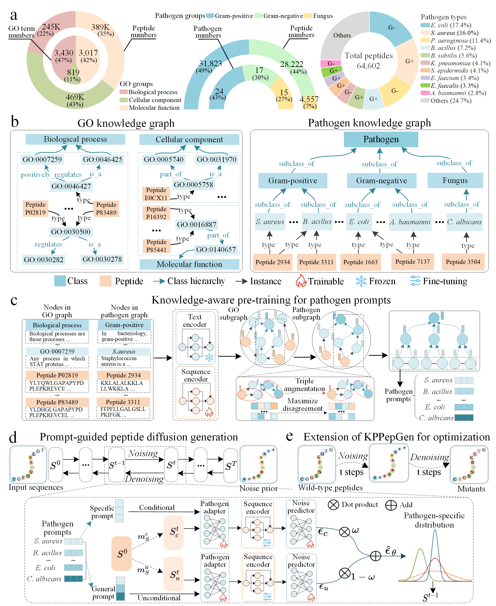

# *De novo* generation of pathogen-specific peptides through knowledge-aware prompt diffusion model

## Introduction

-----

This repository contains the dataset, source code, and package for the paper "*De novo* generation of pathogen-specific peptides through knowledge-aware prompt diffusion model". KPPepGen employs the knowledge-aware peptide pre-training process in two distinct stages, integrating GO and pathogen knowledge. In the subsequent peptide generation, KPPepGen leverages the learned pathogen-specific prompts from these knowledge graphs, employing a prompt-guided diffusion, to generate biologically plausible peptides tailored to various pathogen tasks.


## Overview of KPPepGen 

_____




## Table of Contents

------

+ [Installation](#Installation)
+ [Datasets](#Datasets)
+ [Pretraining process for GO/pathogen knowledge](#Pretraining)
+ [Training  process for peptide diffusion](#Training)
+ [Usage for pathogen-specific peptides](#Usage)
+ [Cite Us](#Cite)


<h3 id="Installation">Installation</h3>

-----------

Our code environment relies on the Conda package management system, accessible at [Miniconda installation documentation](https://docs.anaconda.com/miniconda/miniconda-install/). To set up the environment, first create a virtual environment and then install the necessary packages using the `environment.yml` file provided.


<h3 id="Datasets">Datasets</h3>

-----

### Peptides with GO knowledge

From the Gene Ontology (GO) database, we downloaded the go-basic [file](https://www.geneontology.org/docs/download-ontology/).  From the UniProtKB database, we collected peptides with the GO annotations and extracted peptide-GO pairs.

+ `data/source/uniport/`
  + `go-basic.obo`: The basic version of GO annoations. This version is used with most GO-based annotation tools.
  + `GO_id_def.pkl`; `go_prefeature.pkl`:  The annoation text for each GO terms in GO knowledge graph; the preprocessing features of these annoations through PubMedBERT. The code files for preprocessing `util/data_process/GO_info.py`; `util/embedding/go_terms.py`
  + `go_go_triple.csv`: The relationships among GO terms that span across GO hierarchies are referred to as GO-GO triples.
  + `uniport_peptide.fasta`: Over 764K peptides were collected from the [Uniport databse](https://www.uniprot.org/uniprotkb).
  + `peptide_go_triple.csv`: The relationships between these peptides and GO terms are represented as peptide-GO triples.

### Peptides with pathogen knowledge

We curated the antimicrobial peptide dataset from seven databases, including [APD3](https://aps.unmc.edu/), [CAMP](https://camp3.bicnirrh.res.in), [DBAMP](https://awi.cuhk.edu.cn/dbAMP), [DRAMP](http://dramp.cpu-bioinfor.org), [SATPdb](http://crdd.osdd.net/raghava/satpdb),[YADAMP](http://www.yadamp.unisa.it), and[LAMP](http://biotechlab.fudan.edu.cn/database/lamp). 

+ `data/source/amp/`
  + `amp_peptide.fasta; amp_peptide_without_pathogen.fasta`: Antimicrobial peptides with/without available pathogen annoations.
  + `pathogen_description.csv`:  The annoation text for each pathogen terms in pathogen knowledge graph.
  + `peptide_pathogen_triple.csv`: The relationships between above peptides and pathogen terms, described as peptide-pathogen triples.

<h3 id="Pretraining">Pretraining process for GO/pathogen knowledge</h3>

---

Please review the parameter settings in 'config.py' and adjust them as needed to meet your requirements.

### Pretraining for GO knowledge

First, address the relationships among GO terms by running:

```python
python pretrain_go_go_triple.py --n_max_epochs 6000 --batch_size 2048 --learning_rate 1e-4
# default saving checkpoint at "data/output/go_go_triple/"
```

Next, load the parameters of the pre-trained goGoModel and initiate the pre-training for peptide-GO triples by running:

```python
python pretrain_pep_go_triple.py --n_max_epochs 500 --batch_size 512 --learning_rate_seq 1e-4 --learning_rate_go 5e-5 --goGoTriple_checkpoint path_to_point
# default saving checkpoint at "data/output/pep_go_triple/"
```

### Pretraining for pathogen knowledge

To load the parameters of the pre-trained pepGoTriple model and initiate pre-training for pathogen knowledge, please run:

```python
python pretrain_pep_pathogen_triple.py --n_max_epochs 3000 --batch_size 1024 --learning_rate_seq 1e-4 --learning_rate_go 5e-5 --pepGoTriple_checkpoint path_to_point
# default saving checkpoint at "data/output/pep_pathogen_triple"
```
The pre-processed GO/strain knowledge graph files is available at are publicly accessible via our [Zenodo repository](https://zenodo.org/records/15660801)


<h3 id="Training">Training  process for peptide diffusion</h3>

----------

+ Load the pre-trained pepPathogenTriple model and extract the learned pathogen features as prompts for subsequent generation, details in function `get_pathogen_KG_feature_from_pretraining` at `data/models/KgTripleModel.py` . The pathogen prompt file is automatically saved at: `data/source/amp/pathogen_KG_prefeature.pkl`
+ To load the parameters of the pre-trained pepPathogenTriple model and initiate training for peptide diffusion, please run:

```python
python kg_cond_diff.py --n_max_epochs 5000 --batch_size 256 --n_timestep 1000 --learning_rate_seq 1e-4 --learning_rate_go 5e-5 --pepPathogenTriple_checkpoint path_to_point
# default saving checkpoint at "data/output/pepSeqCondDiff"
```


<h3 id="Usage">Usage for pathogen-specific peptide generation</h3>

-----

+ Based on the given pathogen type, we sample the noising sequence from the corresponding marginal distribution and execute the denoising process to generate new peptides.
+ Available 56 pathogen types for peptide generation can be found in `data/source/amp/pathogen_description.csv`

```python
import torch
from models.CPDiffusionModel import KGCondDiffusion

device = torch.device("cuda:0" if torch.cuda.is_available() else "cpu")

model = KGCondDiffusion().load_from_checkpoint("path_to_point",
    map_location=device)
# load the trained peptide model

model = model.to(device)
model.eval()

with torch.no_grad():
    out_seq_list, out_seq_traj, record_path = model.denoise_seq_sample(
        n_seq=2000,
        # output sequence numbers
        pathogen_type="pathogen type",
        # given pathogen type; like "S.aureus","E.faecalis", "E.coli","A.baumannii"
        fasta_out_statue=True,
        # save the output sequences as fasta file
        file_name="file_name"
        # output file name
    )
    # out_seq_list: generated peptide sequences for the given pathogen requirment
    # out_seq_traj: trajectory record of amino acid for each generated peptide
    # record_path: path to the output fasta file
```

+ The output file is peptide sequences in FASTA format.

```python
>AMP_0
FAIRWHKCGGLNGLKNLRAY
>AMP_1
NIICTTKPKGPGRVQLLCLACGQA
>AMP_2
QNRQTCSAAPRQLRNKRTAHR
...
```

+ Code for evaluating the generated peptides is available at: `data/util/evaluation.py` 

+ Our knowledge graph and pretrained model are designed to support continuous updates with new peptide-pathogen knowledge. 
  + To incorporate novel peptide-pathogen relationships, pathogen names must be standardized following the nomenclature provided by the [gcPathogen](https://nmdc.cn/gcpathogen/) database.
  + For pathogens not included among the 56 species in this study, their biological descriptions should be retrieved from Wikipedia and added to the corresponding file `pathogen_description.csv`.
  + New peptide-pathogen associations can be appended as triples in the designated input files, including `peptide_pathogen_triple.csv` and `amp_peptide.fasta`.
  + The pretrained knowledge model can be fine-tuned with a small learning rate to update its parameters. The newly added or updated pathogen prompts could be utilized for further peptide generation.

<h3 id="Cite">Cite Us</h3>

Feel free to cite this work if you find it useful to you !

```python
@article{KPPepGen,
    title={\textit{De novo} generation of pathogen-specific peptides through knowledge-aware prompt diffusion model},
    author={Yongkang Wang, Menglu Li, Feng Huang, Minyao Qiu, and Wen Zhang},
    year={2025},
}
```


